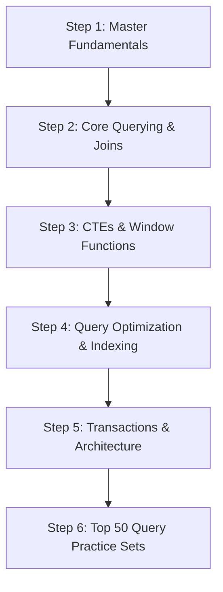

# SQL Interview Question Bank & Study Guide

Welcome to the comprehensive SQL Interview Question Bank repository! This resource is structured for quick revision, deep-dive theoretical mastery, and hands-on query practice for software engineering, data engineering, and data analytics interviews.

---

## Resource Modules

| Module | Description | Target Use Case |
| :--- | :--- | :--- |
| ⚡ [SQL Cheatsheet](file:///s:/Interview_Preperation/Interview_subject/sql/SQL_Cheatsheet.md) | Exhaustive reference guide covering DDL, DML, TCL, DCL, Joins, Window Functions, Aggregate/String/Date functions, and Query Optimization. | Quick revision before an interview |
| ❓ [Top 100 SQL Interview Questions](file:///s:/Interview_Preperation/Interview_subject/sql/Top_100_SQL_Interview_Questions.md) | 100 conceptual, technical, and architectural questions with detailed answers categorized into 6 core sections. | Comprehensive concept mastery |
| 💻 [Top 50 SQL Query Practice](file:///s:/Interview_Preperation/Interview_subject/sql/Top_50_SQL_Query_Practice.md) | 50 real-world SQL query practice problems ranging from Easy to Hard with schema definitions, sample input, SQL queries, and logic breakdowns. | Coding round & live query practice |

---

## Recommended Study Roadmap

### Phase 1: Core Fundamentals & Syntax
- Read [SQL Cheatsheet](file:///s:/Interview_Preperation/Interview_subject/sql/SQL_Cheatsheet.md) Sections 1 to 5.
- Study [Top 100 Questions](file:///s:/Interview_Preperation/Interview_subject/sql/Top_100_SQL_Interview_Questions.md) (Q1 – Q25).
- Practice [Top 50 Practice Queries](file:///s:/Interview_Preperation/Interview_subject/sql/Top_50_SQL_Query_Practice.md) Easy Problems (1 – 15).

### Phase 2: Joins, CTEs & Window Functions
- Read [SQL Cheatsheet](file:///s:/Interview_Preperation/Interview_subject/sql/SQL_Cheatsheet.md) Sections 6 to 8.
- Study [Top 100 Questions](file:///s:/Interview_Preperation/Interview_subject/sql/Top_100_SQL_Interview_Questions.md) (Q26 – Q65).
- Practice [Top 50 Practice Queries](file:///s:/Interview_Preperation/Interview_subject/sql/Top_50_SQL_Query_Practice.md) Medium Problems (16 – 35).

### Phase 3: Advanced Optimization, Architecture & Hard Problems
- Read [SQL Cheatsheet](file:///s:/Interview_Preperation/Interview_subject/sql/SQL_Cheatsheet.md) Sections 9 & 10.
- Study [Top 100 Questions](file:///s:/Interview_Preperation/Interview_subject/sql/Top_100_SQL_Interview_Questions.md) (Q66 – Q100).
- Practice [Top 50 Practice Queries](file:///s:/Interview_Preperation/Interview_subject/sql/Top_50_SQL_Query_Practice.md) Hard Problems (36 – 50).

---

## Top Interview Topics Index

- **Gaps & Islands Problems**: [Practice Problem 36](file:///s:/Interview_Preperation/Interview_subject/sql/Top_50_SQL_Query_Practice.md#problem-36-human-traffic-of-stadium-gaps--islands), [Practice Problem 39](file:///s:/Interview_Preperation/Interview_subject/sql/Top_50_SQL_Query_Practice.md#problem-39-consecutive-active-days-user-retention--user-streaks)
- **Nth Highest Salary**: [Q49](file:///s:/Interview_Preperation/Interview_subject/sql/Top_100_SQL_Interview_Questions.md#q49-how-do-you-find-the-nth-highest-salary-in-sql-using-window-functions), [Practice Problem 1](file:///s:/Interview_Preperation/Interview_subject/sql/Top_50_SQL_Query_Practice.md#problem-1-second-highest-salary), [Practice Problem 16](file:///s:/Interview_Preperation/Interview_subject/sql/Top_50_SQL_Query_Practice.md#problem-16-nth-highest-salary-function)
- **Window Ranking (`ROW_NUMBER` vs `RANK` vs `DENSE_RANK`)**: [Q48](file:///s:/Interview_Preperation/Interview_subject/sql/Top_100_SQL_Interview_Questions.md#q48-explain-the-difference-between-row_number-rank-and-dense_rank), [Cheatsheet Section 7](file:///s:/Interview_Preperation/Interview_subject/sql/SQL_Cheatsheet.md#7-window-functions)
- **Duplicate Removal**: [Q65](file:///s:/Interview_Preperation/Interview_subject/sql/Top_100_SQL_Interview_Questions.md#q65-how-do-you-delete-duplicate-rows-while-keeping-only-one-copy), [Practice Problem 7](file:///s:/Interview_Preperation/Interview_subject/sql/Top_50_SQL_Query_Practice.md#problem-7-delete-duplicate-emails)
- **Recursive CTEs & Hierarchies**: [Q37](file:///s:/Interview_Preperation/Interview_subject/sql/Top_100_SQL_Interview_Questions.md#q37-what-is-a-recursive-cte-explain-its-components), [Cheatsheet Section 6](file:///s:/Interview_Preperation/Interview_subject/sql/SQL_Cheatsheet.md#6-subqueries--common-table-expressions-ctes)
- **ACID & Isolation Levels**: [Q82 - Q84](file:///s:/Interview_Preperation/Interview_subject/sql/Top_100_SQL_Interview_Questions.md#part-5-transactions-concurrency--security-q81---q90)
- **Query Execution & Indexing**: [Q66 - Q80](file:///s:/Interview_Preperation/Interview_subject/sql/Top_100_SQL_Interview_Questions.md#part-4-database-architecture-indexing--optimization-q66---q80)
