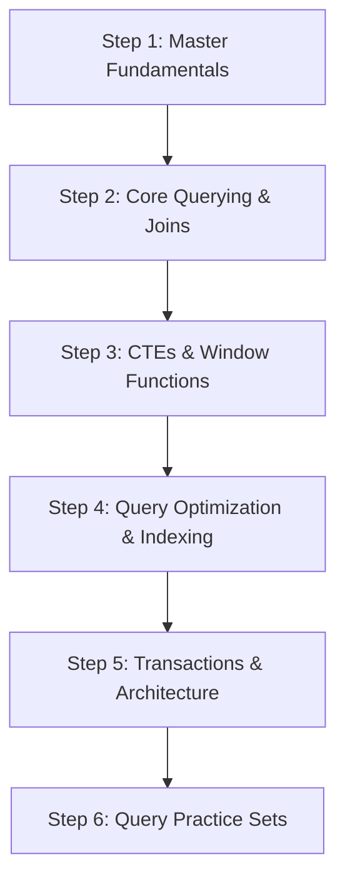

# SQL Interview Question Bank & Study Guide

Welcome to the comprehensive SQL Interview Question Bank repository! This resource is structured for quick revision, theoretical mastery, and hands-on query practice for software engineering, data engineering, and data analytics interviews.

---

## Resource Modules

| Module | Description | Target Use Case |
| :--- | :--- | :--- |
| ⚡ [SQL Cheatsheet](file:///s:/Interview_Preperation/Interview_subject/sql/SQL_Cheatsheet.md) | Reference guide covering DDL, DML, TCL, DCL, Joins, Window Functions, Aggregate/String/Date functions, and Query Optimization. | Quick revision before an interview |
| ❓ [SQL Interview Questions](file:///s:/Interview_Preperation/Interview_subject/sql/SQL_Interview_Questions.md) | Conceptual, technical, and architectural questions with detailed answers categorized into core sections. | Comprehensive concept mastery |
| 💻 [SQL Query Practice](file:///s:/Interview_Preperation/Interview_subject/sql/SQL_Query_Practice.md) | Real-world SQL query practice problems ranging from Easy to Hard with schema definitions, sample input, SQL queries, and logic breakdowns. | Coding round & live query practice |

---

## Recommended Study Roadmap

### Phase 1: Core Fundamentals & Syntax
- Read [SQL Cheatsheet](file:///s:/Interview_Preperation/Interview_subject/sql/SQL_Cheatsheet.md) Sections 1 to 5.
- Study [SQL Interview Questions](file:///s:/Interview_Preperation/Interview_subject/sql/SQL_Interview_Questions.md) (Q1 – Q15).
- Practice [SQL Query Practice](file:///s:/Interview_Preperation/Interview_subject/sql/SQL_Query_Practice.md) Easy Problems (1 – 15).

### Phase 2: Joins, CTEs & Window Functions
- Read [SQL Cheatsheet](file:///s:/Interview_Preperation/Interview_subject/sql/SQL_Cheatsheet.md) Sections 6 to 8.
- Study [SQL Interview Questions](file:///s:/Interview_Preperation/Interview_subject/sql/SQL_Interview_Questions.md) (Q16 – Q42).
- Practice [SQL Query Practice](file:///s:/Interview_Preperation/Interview_subject/sql/SQL_Query_Practice.md) Medium Problems (16 – 35).

### Phase 3: Advanced Optimization, Architecture & Hard Problems
- Read [SQL Cheatsheet](file:///s:/Interview_Preperation/Interview_subject/sql/SQL_Cheatsheet.md) Sections 9 & 10.
- Study [SQL Interview Questions](file:///s:/Interview_Preperation/Interview_subject/sql/SQL_Interview_Questions.md) (Q43 – Q60).
- Practice [SQL Query Practice](file:///s:/Interview_Preperation/Interview_subject/sql/SQL_Query_Practice.md) Hard Problems (36 – 50).
